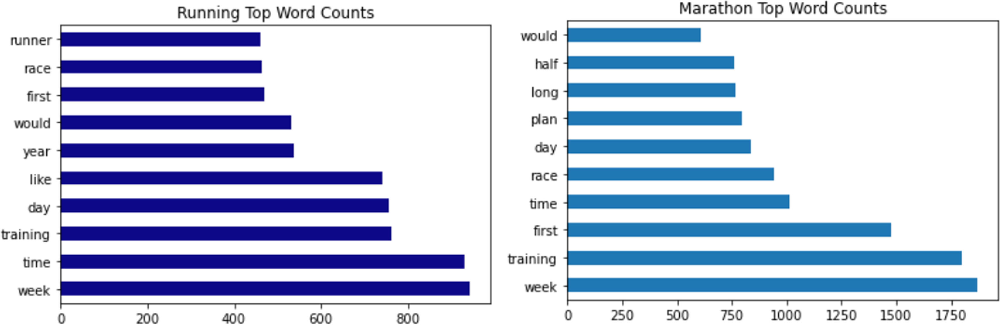
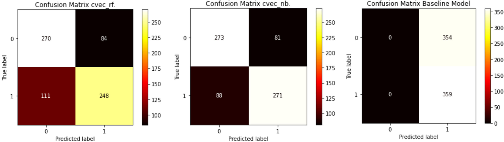
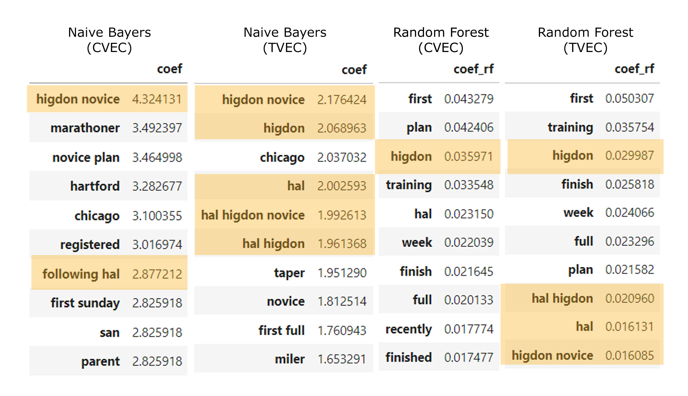

# Project 3: Web APIs & NLP

DSI30 Submission by Cheong Hao Ming

## Problem Statement

Running Lab is a home grown running specialty store that retails everything running. Despite the recent pandemic, running, more specifically marathon running has been gaining much popularity among Singaporeans. Marathon runners has long been a target group for Running Lab as this group of runners tend to spend the most time and money in the sport.

Therefore, Running Lab would like to learn more about first time marathon runners while navigating through the chatter of the general running discussions and more marathon specific content. In fact, they would like to deep dive into the discussions of first time marathon runners to bring in the appropriate products and services catering to this group of customers.

As such, the management of Runnining Lab has commissioned our consultancy to create a classification model to seperate the generic running discussion and discussions pertaining to first time marathoners.

## Data Collection

Submission data from both running and firstmarathon subreddit has been collected using api.pushshift.io. However the maximum limit of scrapping 100 submissions at a time meant that we needed to create loop for the data collection program to run several iterations. In this case, 18 iterations as been set for both subreddits and 1800 submissions has been scrapped from each of them. From the submissions, we will be using the "title" and "selftext" for our modelling.

## Data Cleaning and EDA

A new column called "atext" is first created by combining the contents of "selftext" and "title", this is to reduce dropping rows due to NaN (usually caused by a image only post) in the "selftext" column. Problematic fields such as "[removed]", "[deleted]" and null in the "selftext" column are replaced with a empty string before concating it with the "title" columns.

Duplicates and null values rows in the "atext" columns are then drop together with the now redundant "selftext" and "title" column. After this cleaning, we are still left with 1770 rows from the running subreddit and 1794 rows from the firstmarathon subreddit.

A function is then created to convert the contents in "atext" into a meaningful long string that will help to train our classification model. The function will do the following:
1. Remove URL with regex
2. Remove HTML characters
3. Remove non-letters
4. Convert to lower case and split them into individual words
5. Lemmatize words to reduce similar words
6. Remove predefined stop words (with addition after EDA)
7. Join the remaining words back into a long string

A simple EDA is then conducted to visualize words with high count in the two subreddits.

After comparing the two bar chart for top word counts from the running and marathon dataset, we do see a good mix of common words among the two with week and training both in the top 3 spots in terms of word count altough both words appears more often in marathon posts.

Some unique words that are only found in Marathon's top ten list are "long", "plan" and "half". They seem reasonable as first time marathoners are likely to need a training plan, will introduce more long runs in their training and the word "half" probably came from discussion on half marathons.

The two dataframe are then concated together for preprocessing and modelling.

## Preprocessing and Modeling¶

The model is first set up to read "firstmarathon" as 1 and "running" as 0. A train test split with 80% train and 20% test data is then initiated.

2 functions are created to aid in the modelling process. First is the modelling function itself which will create a pipeline based on the word vectorizer model as well as the classification model chosen. The function will print the optimal parameter to help in parameter tuning, as well as the various metrics for scoring the models.

A confusion matrix will also be create to help visualise the model's performace. For the Naive Bayers, Logistic Regressiona and Random Forest models, the top 10 useful words with their coefficient will also be displayed in a table form.

The second function help to generate the list a parameters associated with the selected word vectorizer and classification model.

Different parameters are tuned and test after each run to find the optimal paramenter for each model.

## Model Evaluation

A total of 9 models were created with the 2 functions and a baseline model was also created for model evaluation. The table below summarizes the results and performance of all the models:

|    |   **Vectorizer** |      **Classifier** | **Train** | **Test** | **Train-Test** | **Best Score** | **Specificity** | **Sensitivity** |
|---:|-----------------:|--------------------:|-----------|----------|----------------|----------------|-----------------|-----------------|
| 1  | Baseline         | Baseline            | NA        | NA       | NA             | 0.503          | 0.0              | 1.0              |
| 2  | Count Vectorizer | Naive Bayers        | 0.859     | 0.763    | 0.096          | **0.802**      | 0.771           | 0.755           |
| 3  | Tfidf Vectorizer | Naive Bayers        | 0.879     | 0.762    | 0.117          | 0.795          | 0.749           | 0.774           |
| 4  | Count Vectorizer | Logistic Regression | 0.920     | 0.767    | 0.153          | 0.789          | 0.740           | 0.794           |
| 5  | Tfidf Vectorizer | Logistic Regression | 0.895     | 0.774    | 0.121          | 0.789          | **0.799**       | 0.749           |
| 6  | Count Vectorizer | K Nearest Neighbor  | 0.746     | 0.620    | 0.126          | 0.627          | 0.342           | **0.894**       |
| 7  | Tfidf Vectorizer | K Nearest Neighbor  | 0.676     | 0.539    | 0.137          | 0.545          | 0.257           | 0.816           |
| 8  | Count Vectorizer | Bagging             | 0.980     | 0.718    | 0.262          | 0.732          | 0.698           | 0.738           |
| 9  | Count Vectorizer | Random Forest       | 0.791     | 0.727    | **0.064**      | 0.754          | 0.777           | 0.652           |
| 10 | Tfidf Vectorizer | Random Forest       | 0.797     | 0.715    | 0.082          | 0.754          | 0.790           | 0.643           |

With reference to the table above that compares the baseline model with all the other classification models constructed, model 2 (CountVectorizer Naive Bayers) is our model of choice since it acheived the highest accuracy score of 0.802 while maintaining a small overfitting problem relative to the other models.

While model 9 (CountVectorizer Random Forest) does not overfit as much compared to our choice model, it does not score as well in terms of accuracy and the model tends to lean towards classifying "0" or "running" as reflected by the lower sensitivity score. The weakness of model 9 is also highlighted by the red box in the confusion matrix which shows a disporportionate high number of false negatives.

When compared to the baseline model, we also observe a good improvement in terms of the accuracy score from 0.503 for the baseline and 0.802 for our choice model. This further justifies that our model will be useful in helping classify marathon and general running contents.

## Conclusion and Recommendations

In conclusion, after fitting our data into nine different models and tuning their parameters, we will recommend the management of Running Lab to adopt Model 2 (CountVectorizer Naive Bayers) as the classifier model for classifying marathon content and running content base on the overall performance of the model.

We also observe the consistent appearance of Hal Higdon in as meaningful words used by the various models experimented, including our choice model. It suggest that many first time marathoners seems to be keen on following his training programs or at least, have queries and discussions about them. Running Lab may want to look into the training plans and running content provided on Hal Higdon's website so gain insight on what product and services might iterest the marathoners.

Running lab may also want to explore the possibility of co-branding possibilities with Hal Higdon to really establish itself as a running and marathon speciality store, differentiating itself from the competition.

## Future Works

While our recommended model acheived a good accuracy score of 0.802, we given more time and resource to scrap more data, it is possible better train and further improve on the model's peformance.

Running Lab may also want to consider reading in more localized data such as from HardwareZone.sg forum as reddit is still a predominantly US based forum.

we may also want to dig deeper into the other meaningful words used by the models to derive more insights about what seperates discussions on marathons and normal running.